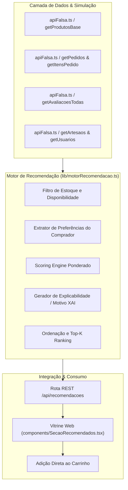

# Documento de Entrega — Inteligência Artificial (Unidade 01 / AV1)

**Projeto:** Raízes PE — Marketplace da Economia Criativa de Pernambuco  
**Disciplina:** Inteligência Artificial aplicada ao Projeto Integrador (4º Período ADS - CESAR School)  
**Ticket Jira:** [PI4-26: W08-Entregas U1 (IA)](https://csprj-adsr-4p-e4.atlassian.net/browse/PI4-26)  
**Responsável:** Caio Gilles Costa Medeiros de Souza (`cgcms@cesar.school`)  
**Colaboradores:** Pedro Henrique Cavalcanti E Silva, Bruno Sottomayor Martin e equipe  
**Data:** Setembro de 2026  
**Versão:** 1.0  

---

## 1. Visão Geral e Contexto de Negócio

O **Raízes PE** é uma plataforma de marketplace focada na valorização da economia criativa e do artesanato de Pernambuco, aproximando artesãos do Litoral ao Sertão de compradores apreciadores da cultura regional.

No contexto de e-commerce e curadoria cultural, os compradores muitas vezes enfrentam dificuldade para descobrir peças alinhadas à sua identidade cultural ou ao seu histórico de apreciação (ex.: entalhe em madeira do Vale do Catimbau, xilogravura do Agreste, cerâmica figurativa de Caruaru, renda renascença do Sertão).

O objetivo do módulo de IA na Unidade 01 é estabelecer uma **Linha de Base (Baseline)** robusta, explicável e reproduzível para o sistema de recomendação de produtos. Essa baseline atua como alicerce de comparação e garantia de valor imediato, preparando a arquitetura para modelos preditivos mais complexos na Unidade 02.

---

## 2. Arquitetura da Solução

O módulo de IA opera de forma totalmente desacoplada e integrada ao ecossistema da aplicação:



### Componentes Chave:
1. **`lib/motorRecomendacao.ts`**: Núcleo algorítmico responsável pelo scoring, filtragem e geração de justificativas.
2. **`app/api/recomendacoes/route.ts`**: Rota HTTP REST que serve as recomendações de acordo com o Contrato da API (`docs/CONTRATO_API.md`).
3. **`components/SecaoRecomendados.tsx`**: Interface do usuário integrada à vitrine pública, exibindo cards enriquecidos com badges de recomendação explicável e troca dinâmica de perfil para testes.

---

## 3. Formulação Heurística e Algoritmo de Pontuação (*Scoring Engine*)

A baseline adota uma abordagem híbrida de **Filtragem Baseada em Conteúdo (Content-Based Filtering)** combinada com **Popularidade Geral e Recorrência Regional**.

Para cada produto candidato $p \in P_{\text{disponíveis}}$, a pontuação final $S(p, u)$ para um usuário $u$ é calculada da seguinte forma:

$$S(p, u) = S_{\text{base}}(p) + S_{\text{personalização}}(p, u) + S_{\text{novidade}}(p) - S_{\text{penalidade}}(p, u)$$

### 3.1. Pontuação Base ($S_{\text{base}}$)
Derivada da aceitação coletiva da comunidade:
$$S_{\text{base}}(p) = (\text{notaMédia}(p) \times 10) + (\text{qtdAvaliações}(p) \times 2)$$

- Garante que produtos bem avaliados e com volume expressivo de avaliações tenham maior peso inicial.

### 3.2. Personalização por Histórico ($S_{\text{personalização}}$)
Quando o usuário $u$ possui compras anteriores registradas no sistema:

1. **Afinidade de Técnica ($A_{\text{técnica}}$):**
   $$S_{\text{técnica}} = 40 + (\text{comprasNaTécnica}(u, p.\text{tecnica}) \times 10)$$
   Se o usuário comprou itens da técnica de $p$, recebe bônus substancial de aderência temática.
2. **Afinidade de Região Geográfica ($A_{\text{região}}$):**
   $$S_{\text{região}} = 25$$
   Aplicado caso o artesão pertença a uma mesorregião (Agreste, Sertão, Metropolitana, Zona da Mata) da qual o usuário já consumiu peças.
3. **Destaque por Nota Elevada:**
   $$S_{\text{qualidade}} = 15 \quad (\text{se } \text{notaMédia}(p) \ge 4.5 \text{ e } \text{qtdAvaliações}(p) > 0)$$

### 3.3. Bônus de Novidade ($S_{\text{novidade}}$)
$$S_{\text{novidade}}(p) = 5 \quad (\text{se data de cadastro for inferior a 30 dias})$$

### 3.4. Penalidade de Saturação ($S_{\text{penalidade}}$)
$$S_{\text{penalidade}}(p, u) = 50 \quad (\text{se o usuário } u \text{ já comprou o produto } p)$$
- O objetivo no artesanato exclusivo é estimular a descoberta de novas peças, evitando recomendar a mesma obra que o comprador já possui em casa.

---

## 4. Tratamento de Casos de Borda e Regras de Negócio

### 4.1. Filtragem Rigorosa de Produtos Indisponíveis (Ticket PI4-82)
Peças de artesanato tradicional costumam ser únicas ou de baixa tiragem. Qualquer produto com `estoqueQtd <= 0` é **imediatamente excluído** do conjunto de candidatos antes do cálculo de pontuação:
```typescript
const disponiveis = produtos.filter((p) => p.estoqueQtd > 0);
```

### 4.2. Estratégia de *Cold Start* (Novos Usuários / Visitantes Anônimos - Ticket PI4-84)
Quando o usuário não está autenticado ou não possui compras prévias:
- O motor prioriza as obras com maior prestígio e reconhecimento comunitário ($\text{notaMédia} \ge 4.5$).
- Como critério secundário, diversifica a exibição de técnicas e regiões culturais autênticas.
- Motivo exibido: *"Mais bem avaliados da comunidade (4.9 ★)"* ou *"Peça artesanal autêntica do Sertão"*.

---

## 5. Explicabilidade (Explainable AI - XAI)

Para aumentar a confiança do usuário e conectar o comprador à narrativa cultural do artesanato, cada recomendação é acompanhada de uma justificativa em linguagem natural:

| Critério Ativado | Exemplo de Motivo Exibido na Vitrine |
| :--- | :--- |
| `historico_tecnica` | *"Inspirado no seu apreço por Xilogravura"* |
| `historico_regiao` | *"Tradição do Agreste, de onde você já comprou"* |
| `popularidade` | *"Alta recomendação da comunidade (4.9 ★)"* |
| `novidade` | *"Peça artesanal autêntica da Região Metropolitana"* |

No frontend (`components/SecaoRecomendados.tsx`), esses motivos são renderizados com ícones e badges temáticos que destacam o diferencial cultural de cada peça.

---

## 6. Integração com a API REST

O endpoint `GET /api/recomendacoes` segue estritamente o padrão JSON e códigos de resposta HTTP:

- **URL:** `/api/recomendacoes?usuarioId={id}&limite={n}`
- **Método:** `GET`
- **Exemplo de Resposta (Status 200 OK):**
```json
{
  "sucesso": true,
  "dados": [
    {
      "id": "p1",
      "nome": "Vaso de Cerâmica Maragogipinho",
      "preco": 120.0,
      "tecnica": "Cerâmica",
      "artesaoNome": "Mestre Vitalino Neto",
      "artesaoRegiao": "Agreste",
      "motivo": "Inspirado no seu apreço por Cerâmica",
      "score": 105.0,
      "criterio": "historico_tecnica"
    }
  ],
  "total": 1
}
```

---

## 7. Validação e Testes Automatizados

Para garantir a confiabilidade da baseline, foi desenvolvida uma suíte de testes automatizados com o executor nativo do Node.js (`tests/recomendacao.test.mjs`), cobrindo os seguintes cenários:

1. **Garantia de Estoque:** Nenhuma peça com estoque esgotado é recomendada.
2. **Personalização por Histórico:** Compradores com histórico em Xilogravura ou Cerâmica têm seus produtos pontuados no topo.
3. **Resolução de Cold Start:** Usuários anônimos recebem os produtos mais bem avaliados e populares.
4. **Despriorização de Repetição:** Obras já compradas pelo usuário perdem pontuação prioritária.
5. **Rastreabilidade de Explicabilidade:** 100% dos itens recomendados contêm `motivo` preenchido e legível.

Execução:
```bash
npm test
```

---

## 8. Métricas Offline de Avaliação e Próximos Passos (Unidade 02)

Para a Unidade 02, o desempenho da baseline estabelecida nesta entrega será mensurado e comparado contra modelos mais avançados através das seguintes métricas:

1. **Precision@K e Recall@K:** Proporção de itens relevantes entre os $K$ produtos recomendados.
2. **NDCG@K (Normalized Discounted Cumulative Gain):** Avaliação da qualidade do ranking, premiando itens de alta relevância nas primeiras posições.
3. **Catalog Coverage:** Percentual do catálogo de artesãos que tem visibilidade através das recomendações.
4. **Novelty & Serendipity:** Capacidade do modelo de surpreender o comprador positivamente com artesãos emergentes fora de sua zona de conforto.

### Roadmap Técnico para a Unidade 02:
- Substituição/complementação da heurística de conteúdo por **Filtragem Colaborativa Implícita** (ex.: matrix factorization ALS com base em visualizações, adições ao carrinho e compras).
- Introdução de **Embeddings Vetoriais** (TF-IDF ou modelo semântico) sobre as descrições de técnicas e materiais dos produtos.
- Pipeline de treino offline e persistência de pesos no banco de dados relacional (PostgreSQL).

---

## 9. Rastreabilidade com Tickets do Jira

- **PI4-5:** Epic - IA: Planejamento e baseline de recomendação
- **PI4-17:** W04-Definição do módulo (IA) (Concluído)
- **PI4-20:** W06-Baseline de IA (Concluído)
- **PI4-77 a PI4-86:** Subtarefas de especificação e regras da baseline (Concluído)
- **PI4-27:** W10-Integração das camadas (WEB) (Concluído)
- **PI4-90:** Adicionar seção de recomendações personalizadas na vitrine (Concluído)
- **PI4-26:** W08-Entregas U1 (IA) (Em andamento / Fechamento formal U1)
